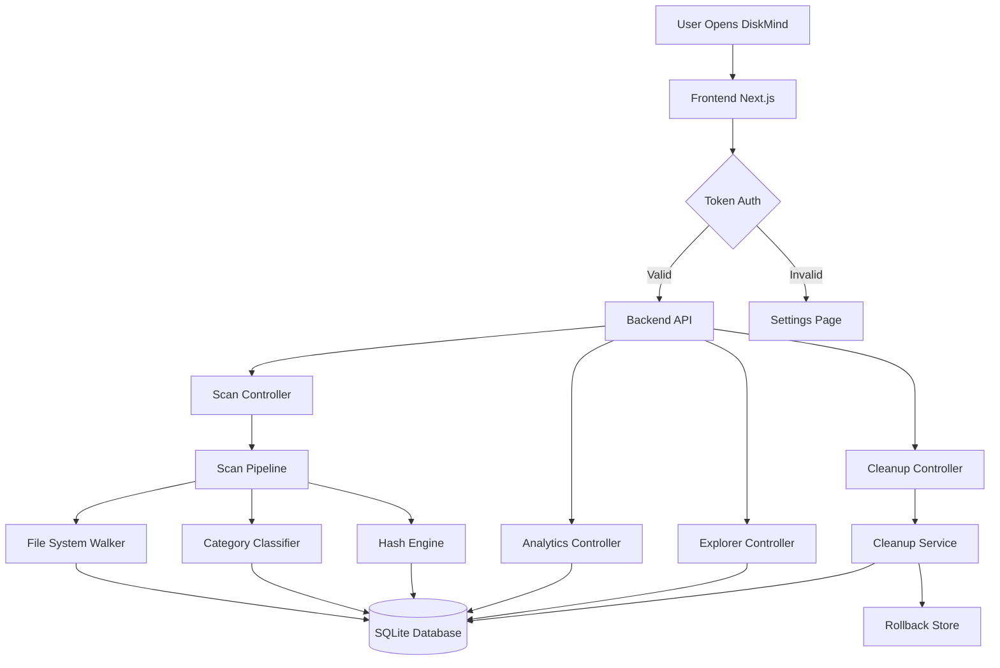
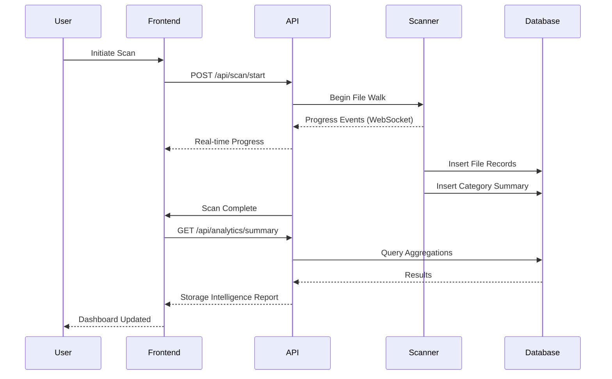

<div align="center">

<!-- Logo -->


<h1>DiskMind</h1>

**The Storage Intelligence Platform for Windows**

*Not just a disk analyzer — an intelligent storage operating system.*

<br />

[](https://github.com/yourusername/diskmind/releases)
[](LICENSE)
[](https://github.com/yourusername/diskmind/actions)
[](https://www.microsoft.com/windows)
[](https://dotnet.microsoft.com)
[](https://nextjs.org)
[](https://github.com/yourusername/diskmind/stargazers)
[](https://github.com/yourusername/diskmind/issues)

<br />

<!-- Banner -->


<br /><br />

[**View Demo**](https://github.com/yourusername/diskmind#demo) · [**Report Bug**](https://github.com/yourusername/diskmind/issues) · [**Request Feature**](https://github.com/yourusername/diskmind/issues) · [**Documentation**](docs/)

</div>

---

## Table of Contents

- [Overview](#overview)
- [Screenshots](#screenshots)
- [Demo](#demo)
- [Features](#features)
- [Feature Showcase](#feature-showcase)
- [Architecture](#architecture)
- [Technology Stack](#technology-stack)
- [Folder Structure](#folder-structure)
- [Installation](#installation)
- [Usage Guide](#usage-guide)
- [Configuration](#configuration)
- [Security](#security)
- [Performance](#performance)
- [Roadmap](#roadmap)
- [Contributing](#contributing)
- [Testing](#testing)
- [Documentation](#documentation)
- [FAQ](#faq)
- [License](#license)
- [Acknowledgements](#acknowledgements)
- [Star History](#star-history)
- [Contact](#contact)

---

## Overview

### The Problem With Traditional Disk Analyzers

Traditional disk analysis tools — WinDirStat, TreeSize, WizTree — show you *where your storage went*. They are file system viewers. They stop at the file. They don't explain why your drive keeps filling up, they can't predict when you'll run out of space, and they have no concept of what is safe to delete.

**DiskMind is not a disk analyzer. It is a Storage Intelligence Platform.**

| Traditional Tools | DiskMind |
|---|---|
| Show files and folders | Understands storage categories |
| Manual navigation | Automated intelligence |
| No cleanup guidance | Risk-scored cleanup recommendations |
| No future predictions | Storage growth forecasting |
| No context awareness | Developer, browser, OS, app context |
| One-off scan | Trend tracking over time |
| No rollback | Safe delete with full rollback |
| No duplicate awareness | Deep content-based duplicate detection |

### What Makes DiskMind Different

DiskMind scans your entire Windows system and classifies every byte of storage into an intelligent taxonomy: OS artifacts, browser caches, developer environments, Docker layers, WSL distributions, game installations, duplicate files, temporary data, logs, crash dumps, and more.

It then assigns each category a **risk score**, shows you **how much space is recoverable**, provides **one-click cleanup with rollback**, and tracks **storage growth trends over time** so you can forecast capacity needs before you run out.

> Built for developers, power users, and IT professionals who need more than a colourful tree map.

---

## Screenshots

<div align="center">

### Dashboard — Storage at a Glance

<sub>The command center. Real-time storage health score, category breakdown, recent activity, and quick actions.</sub>

<br /><br />

### Storage Explorer — Navigate Every Byte

<sub>Breadcrumb-navigable file tree with size, file count, type breakdown, and inline cleanup actions per folder.</sub>

<br /><br />

### Analytics — Visualise Storage Distribution

<sub>Treemap visualisation, category pie charts, file type distribution, and trend sparklines.</sub>

<br /><br />

### Cleanup Center — Safe, Reversible Cleanup

<sub>Risk-scored recommendations, batch actions, preview before delete, and a full rollback history.</sub>

<br /><br />

### Duplicate Detection — Reclaim Hidden Space

<sub>Content-hash-based duplicate detection grouped by file family with smart keep/delete suggestions.</sub>

<br /><br />

### Developer Storage — Your Dev Environment Under a Microscope

<sub>Breakdown of Docker images, WSL distributions, node_modules, Python envs, Rust targets, and more.</sub>

<br /><br />

### Forecast Dashboard — Know Before You Run Out

<sub>Linear regression-based storage growth forecast. Know when your drive will hit critical levels.</sub>

<br /><br />

### Reports — Shareable Storage Reports

<sub>Exportable, shareable storage reports. AI-generated summaries (with optional API key).</sub>

<br /><br />

### Settings — Full Control

<sub>Scan configuration, exclusions, cleanup behaviour, security settings, and API integrations.</sub>

</div>

---

## Demo

<div align="center">

### Live Feature Walkthrough


<sub>Full walkthrough: scan → explore → analyse → clean → rollback</sub>

<br />

### Video Demo

[](https://youtu.be/your-demo-video-link)
<sub>▶ Watch the 3-minute full product demo</sub>

</div>

---

## Features

### Storage Analysis

| Feature | Description | Benefit | Status |
|---|---|---|---|
| Full Drive Scan | Recursive scan of all files and folders | Complete storage inventory | ✅ Available |
| Category Classification | 20+ storage categories auto-detected | Understand what each category costs | ✅ Available |
| Large File Discovery | Surface files above configurable size thresholds | Instantly find hidden space hogs | ✅ Available |
| File Type Analysis | Breakdown by extension and MIME type | Understand storage composition | ✅ Available |
| Real-Time Progress | Live scan progress with file count and speed | Transparent scanning | ✅ Available |
| Incremental Scanning | Re-scan changed paths only | Faster subsequent scans | 🔜 Planned |

### Storage Intelligence

| Feature | Description | Benefit | Status |
|---|---|---|---|
| Storage Health Score | Composite health rating 0–100 | Instant health assessment | ✅ Available |
| Risk Scoring | Each recommendation assigned a risk tier | Safe, informed cleanup | ✅ Available |
| Category Intelligence | Understands OS, browser, dev, game storage | Contextual cleanup guidance | ✅ Available |
| Space Recovery Estimates | Calculates safe recoverable space per category | Prioritise high-impact cleanup | ✅ Available |
| Anomaly Detection | Detects unusually large files or folders | Catch unexpected growth | 🔜 Planned |
| AI-Powered Insights | Natural language storage analysis (API key required) | Plain English recommendations | 🔜 Planned |

### Cleanup Engine

| Feature | Description | Benefit | Status |
|---|---|---|---|
| One-Click Cleanup | Execute multiple cleanups in a single action | Effortless space recovery | ✅ Available |
| Risk-Based Recommendations | Recommendations grouped by Safe / Moderate / Risky | Never accidentally delete important files | ✅ Available |
| Preview Before Delete | See exactly what will be removed before confirming | Complete transparency | ✅ Available |
| Full Rollback System | Deleted files moved to rollback store, restorable anytime | Confidence in cleanup | ✅ Available |
| Scheduled Cleanup | Automatic cleanup on schedule | Set-and-forget maintenance | 🔜 Planned |
| Protected Locations | System-critical paths excluded by default | System safety guaranteed | ✅ Available |
| Dry Run Mode | Simulate cleanup without deleting | Test before you act | 🔜 Planned |

### Developer Tools

| Feature | Description | Benefit | Status |
|---|---|---|---|
| Docker Layer Analysis | Size of images, volumes, and build cache | Recover gigabytes of Docker bloat | ✅ Available |
| WSL Distribution Analysis | Size per WSL distro | Manage Linux environments on Windows | ✅ Available |
| node_modules Detection | Detect and size all node_modules directories | Recover npm/yarn bloat | ✅ Available |
| Python Environment Analysis | venv, conda, pipenv environments | Manage Python env sprawl | ✅ Available |
| Rust Build Artifacts | `target/` directory detection | Recover Cargo build cache | ✅ Available |
| Git Repository Analysis | Detect large git repos with loose objects | Manage version control overhead | 🔜 Planned |
| IDE Cache Detection | VS Code, JetBrains, Visual Studio caches | Recover IDE storage bloat | ✅ Available |
| Build Artefact Detection | `bin/`, `obj/`, `dist/`, `out/` directories | Remove stale build output | ✅ Available |

### Analytics & Forecasting

| Feature | Description | Benefit | Status |
|---|---|---|---|
| Historical Trend Tracking | Tracks storage state across multiple scans | See growth patterns over time | ✅ Available |
| Growth Forecasting | Linear regression forecasting of storage growth | Know when you'll hit capacity | ✅ Available |
| Category Trend Charts | Per-category growth trends | Identify what's growing fastest | ✅ Available |
| File Type Distribution | Treemap and pie chart breakdowns | Visual storage understanding | ✅ Available |
| Session Comparison | Compare any two scans side-by-side | Understand changes between scans | 🔜 Planned |

### Duplicate Detection

| Feature | Description | Benefit | Status |
|---|---|---|---|
| Content-Hash Detection | SHA-256 based duplicate matching | Exact duplicate detection regardless of name | ✅ Available |
| Duplicate Grouping | Group duplicates by file family | Clear organisation of results | ✅ Available |
| Smart Keep Suggestions | Recommends which copy to keep | Guided decisions | ✅ Available |
| Bulk Duplicate Removal | Remove all but one in a group | Fast cleanup of thousands of duplicates | ✅ Available |
| Photo Duplicate Detection | Near-duplicate image detection | Recover camera roll storage | 🔜 Planned |

### Security & Safety

| Feature | Description | Benefit | Status |
|---|---|---|---|
| Local-Only Architecture | No data leaves your machine | Complete privacy | ✅ Available |
| Token-Based Auth | Auto-generated machine token secures the local API | Prevents rogue apps accessing your scanner | ✅ Available |
| Protected Path List | Critical Windows paths excluded from cleanup | Prevent system damage | ✅ Available |
| Permission-Based Scanning | Skips files your account cannot access | No crash on restricted files | ✅ Available |
| Rollback Store | Deleted files stored before permanent deletion | Reverse any mistake | ✅ Available |

---

## Feature Showcase

### Storage Health Score

DiskMind computes a composite **Storage Health Score** (0–100) based on:

- Free space ratio
- Temporary and cache accumulation
- Duplicate file ratio
- Age of last cleanup
- Growth rate relative to drive size

A score below 50 triggers automatic recommendations. A score below 20 triggers a critical alert.

---

### Risk-Based Cleanup

Every cleanup recommendation carries one of four risk tiers:

| Tier | Colour | Examples | Description |
|---|---|---|---|
| **Safe** | 🟢 Green | Temp files, browser cache, thumbnail cache | 100% recoverable, zero risk |
| **Moderate** | 🟡 Yellow | Old Windows Update files, log files | Very low risk, may affect diagnostics |
| **Caution** | 🟠 Orange | node_modules, Docker volumes, large old files | Functional impact possible |
| **Review** | 🔴 Red | Large unrecognised files, deep system folders | Requires manual review |

---

### Storage Forecasting

Using historical scan data, DiskMind applies **linear regression** to your storage consumption trend and projects:

- Days until 85% capacity
- Days until 95% capacity
- Monthly growth rate (GB/month)
- Top contributing categories

---

### Developer Storage Analysis

DiskMind understands the full developer environment taxonomy:

```
Developer Storage
├── Docker
│   ├── Images
│   ├── Containers
│   ├── Volumes
│   └── Build Cache
├── WSL
│   ├── Ubuntu
│   ├── Debian
│   └── Other Distributions
├── Node.js
│   ├── node_modules (all projects)
│   ├── npm cache
│   └── yarn cache
├── Python
│   ├── venv environments
│   ├── conda environments
│   └── pip cache
├── Rust
│   └── Cargo target/ directories
├── IDEs
│   ├── VS Code extensions & cache
│   ├── JetBrains system cache
│   └── Visual Studio component cache
└── Build Output
    ├── bin/ & obj/ (.NET)
    ├── dist/ & out/ (web)
    └── build/ (generic)
```

---

### Duplicate Detection Engine

DiskMind reads every file's actual content (not just name/size) and computes a **SHA-256 hash**. Files with identical hashes are grouped into duplicate families. The engine:

1. Skips OS and system files
2. Prioritises files by size (largest duplicates first)
3. Suggests the most recently modified copy as "keep"
4. Shows total recoverable space per family

---

## Architecture

### System Diagram

```
┌─────────────────────────────────────────────────────────┐
│                    DiskMind Platform                    │
│                                                         │
│  ┌──────────────┐      ┌──────────────────────────────┐ │
│  │   Frontend   │◄────►│        Backend API           │ │
│  │  (Next.js)   │ HTTP │   (ASP.NET Core / .NET 10)   │ │
│  │  Port: 3000  │      │        Port: 5000            │ │
│  └──────────────┘      └──────────┬───────────────────┘ │
│                                   │                     │
│                    ┌──────────────┼──────────────┐      │
│                    │              │              │      │
│            ┌───────▼──────┐ ┌────▼─────┐ ┌─────▼────┐  │
│            │ Scan Pipeline│ │Analytics │ │ Cleanup  │  │
│            │   Engine     │ │  Engine  │ │  Engine  │  │
│            └───────┬──────┘ └────┬─────┘ └─────┬────┘  │
│                    │              │              │      │
│                    └──────────────▼──────────────┘      │
│                              ┌───┴──┐                   │
│                              │SQLite│                   │
│                              │  DB  │                   │
│                              └──────┘                   │
└─────────────────────────────────────────────────────────┘
                         │
                         ▼
              Windows File System (NTFS)
              AppData / Registry / WMI
```

### Component Flow



### Data Flow



---

## Technology Stack

### Frontend

| Technology | Version | Purpose |
|---|---|---|
| [Next.js](https://nextjs.org) | 15 | React framework with App Router |
| [React](https://react.dev) | 19 | UI component library |
| [TypeScript](https://typescriptlang.org) | 5 | Type-safe development |
| [Recharts](https://recharts.org) | Latest | Charts and visualisations |
| [Tailwind CSS](https://tailwindcss.com) | 4 | Utility-first styling |
| [Lucide Icons](https://lucide.dev) | Latest | Icon library |

### Backend

| Technology | Version | Purpose |
|---|---|---|
| [ASP.NET Core](https://dotnet.microsoft.com/apps/aspnet) | .NET 10 | Web API framework |
| [C#](https://learn.microsoft.com/dotnet/csharp/) | 13 | Primary language |
| [Dapper](https://github.com/DapperLib/Dapper) | Latest | Lightweight ORM |
| [Microsoft.Data.Sqlite](https://learn.microsoft.com/dotnet/standard/data/sqlite/) | Latest | SQLite client |
| [System.IO](https://learn.microsoft.com/dotnet/api/system.io) | Native | File system operations |
| [WMI / CimInstance](https://learn.microsoft.com/windows/win32/wmisdk/) | Native | Windows system queries |

### Database

| Technology | Purpose |
|---|---|
| [SQLite](https://sqlite.org) | Local embedded database — no server required |

### Infrastructure

| Tool | Purpose |
|---|---|
| Self-hosted | Runs 100% locally on your Windows machine |
| No cloud required | Fully offline capable |
| No telemetry | Zero data collection |

---

## Folder Structure

```
diskmind/
│
├── frontend/                        # Next.js 15 Frontend Application
│   ├── app/                         # App Router pages
│   │   ├── layout.tsx               # Root layout with sidebar navigation
│   │   ├── page.tsx                 # Dashboard (home) page
│   │   ├── providers.tsx            # React context providers
│   │   ├── SidebarNav.tsx           # Sidebar navigation component
│   │   ├── explorer/                # Storage Explorer page
│   │   ├── duplicates/              # Duplicate Detection page
│   │   ├── analytics/               # Analytics & charts page
│   │   ├── developer/               # Developer Storage page
│   │   ├── reports/                 # Reports page
│   │   ├── trends/                  # Forecast & Trends page
│   │   ├── recommendations/         # Cleanup Recommendations page
│   │   ├── settings/                # Settings & configuration page
│   │   ├── apps/                    # Application storage page
│   │   ├── games/                   # Game storage page
│   │   └── types/                   # File type breakdown page
│   ├── lib/
│   │   ├── api.ts                   # Backend API client (all requests)
│   │   └── types.ts                 # TypeScript type definitions
│   ├── public/
│   │   ├── config.json.example      # Config template for new installs
│   │   └── config.json              # Auto-generated at runtime (gitignored)
│   ├── scripts/
│   │   └── update-config.js         # Reads local token and writes config.json
│   ├── package.json
│   ├── next.config.ts
│   └── tsconfig.json
│
├── backend/                         # .NET 10 Backend API
│   ├── DiskMind.Api/                # Web API project
│   │   ├── Controllers/
│   │   │   ├── ScanController.cs    # Scan start/stop/status endpoints
│   │   │   ├── AnalyticsController.cs # Storage analytics endpoints
│   │   │   ├── ExplorerController.cs  # File tree navigation endpoints
│   │   │   └── CleanupController.cs   # Cleanup & rollback endpoints
│   │   ├── Program.cs               # App entry, CORS, auth, DI, routes
│   │   ├── DiskMind.Api.csproj
│   │   └── DiskMind.Api.http        # HTTP test file
│   ├── DiskMind.Core/               # Core library project
│   │   ├── Scanner/
│   │   │   ├── ScanPipeline.cs      # Orchestrates the full file system scan
│   │   │   └── DuplicateDetector.cs # SHA-256 content-hash duplicate engine
│   │   ├── Intelligence/
│   │   │   ├── IntelligenceEngine.cs           # Health score & recommendations
│   │   │   └── StorageDetectionAndIntelligence.cs # Category classification
│   │   ├── Cleanup/
│   │   │   └── CleanupService.cs    # Cleanup execution and rollback
│   │   ├── Data/
│   │   │   └── DbSchema.cs          # SQLite schema initialisation
│   │   └── DiskMind.Core.csproj
│   └── DiskMind.slnx                # Solution file
│
├── docs/                            # Documentation
│   ├── images/                      # Screenshots and assets for README
│   ├── architecture.md              # Detailed architecture documentation
│   ├── api.md                       # API reference
│   ├── security.md                  # Security model documentation
│   ├── contributing.md              # Contributing guide
│   └── user-guide.md                # End user guide
│
├── .gitignore                       # Git ignore rules
├── README.md                        # This file
└── LICENSE                          # MIT License
```

---

## Installation

### Prerequisites

| Requirement | Version | Notes |
|---|---|---|
| Windows | 10 / 11 | 64-bit required |
| .NET SDK | 10.0+ | [Download](https://dotnet.microsoft.com/download) |
| Node.js | 18+ | [Download](https://nodejs.org) |
| npm | 9+ | Included with Node.js |

### 1. Clone the Repository

```bash
git clone https://github.com/yourusername/diskmind.git
cd diskmind
```

### 2. Backend Setup

```bash
# Restore NuGet packages and build
cd backend
dotnet restore DiskMind.slnx
dotnet build DiskMind.slnx
```

### 3. Frontend Setup

```bash
cd frontend
npm install
```

### 4. Run in Development Mode

**Terminal 1 — Start the Backend:**
```bash
cd backend
dotnet run --project DiskMind.Api/DiskMind.Api.csproj
```

The backend will:
- Start on `http://localhost:5000`
- Create the SQLite database at `%LOCALAPPDATA%\DiskMind\diskmind.db`
- Generate a machine token at `%LOCALAPPDATA%\DiskMind\client_token.txt`
- Print the token to the console

**Terminal 2 — Start the Frontend:**
```bash
cd frontend
npm run dev
```

The frontend will:
- Start on `http://localhost:3000`
- Auto-read the token from `%LOCALAPPDATA%\DiskMind\client_token.txt`
- Write `public/config.json` with the token and port

### 5. Open DiskMind

Navigate to **[http://localhost:3000](http://localhost:3000)** in your browser.

---

### Environment Variables

DiskMind is designed to require zero manual configuration. All settings are auto-generated on first run. However, the following optional environment variables can override defaults:

| Variable | Default | Description |
|---|---|---|
| `DISKMIND_PORT` | `5000` | Backend API port |
| `DISKMIND_DB_PATH` | `%LOCALAPPDATA%\DiskMind\diskmind.db` | SQLite database path |
| `DISKMIND_LOG_LEVEL` | `Information` | Logging verbosity |
| `OPENAI_API_KEY` | *(unset)* | Optional: enables AI-powered reports |

---

## Usage Guide

### Running Your First Scan

1. Open DiskMind at `http://localhost:3000`
2. Click **"Start Scan"** on the Dashboard
3. Select your target drive (default: C:\\)
4. Watch real-time progress as DiskMind walks your file system
5. When complete, the Dashboard populates with your storage intelligence report

> **Tip:** First scans on large drives (500GB+) take 5–15 minutes. Subsequent scans are significantly faster as the engine skips unchanged paths.

---

### Viewing Storage Analytics

Navigate to **Analytics** in the sidebar:

- **Treemap** — Visual representation of space by folder/category
- **Category Breakdown** — Pie chart of storage by category
- **File Type Distribution** — Storage distribution by file extension
- **Top Folders** — Ranked list of largest directories

---

### Detecting Duplicates

Navigate to **Duplicates**:

1. Duplicates are detected automatically during each scan
2. Results are grouped by file family (identical content)
3. Use **"Keep Newest"** or **"Keep Largest"** smart suggestions
4. Click **"Remove Duplicates"** to delete all but the kept copy
5. All deletions go through the rollback system — nothing is permanently gone immediately

---

### Running Cleanup

Navigate to **Recommendations**:

1. Browse recommendations sorted by **risk tier** (Safe → Review)
2. Check the **Space Recoverable** estimate for each item
3. Click **Preview** to see exactly which files will be affected
4. Click **Clean** to execute
5. Find all cleanup history in **Rollback** — restore any item within 30 days

---

### Viewing the Forecast

Navigate to **Trends**:

- View your historical storage growth chart
- See the **projected date** when your drive will hit 85% and 95% capacity
- Identify which storage categories are growing fastest
- Export the forecast as a report

---

## Configuration

### Scan Configuration

| Setting | Default | Description |
|---|---|---|
| Scan Root | `C:\` | Starting path for the scan |
| Exclusions | System-managed | Paths to skip during scan |
| Skip Inaccessible | `true` | Skip files that cannot be read |
| Hash Duplicates | `true` | Enable SHA-256 hashing for duplicate detection |
| Max File Size Threshold | 100 MB | Threshold for "large file" flagging |

### Cleanup Configuration

| Setting | Default | Description |
|---|---|---|
| Rollback Retention | 30 days | How long rollback files are kept |
| Protected Paths | System-managed | Paths that can never be cleaned |
| Confirm Before Delete | `true` | Require confirmation for destructive operations |
| Dry Run Default | `false` | Preview mode on by default |

### Security Settings

| Setting | Default | Description |
|---|---|---|
| Token Auto-Rotate | On restart | Regenerate token when backend restarts |
| Allow External Access | `false` | Restrict API to localhost only |

---

## Security

### Architecture

DiskMind is designed with a **local-first, offline-first, privacy-first** philosophy:

- **No cloud connectivity.** DiskMind never makes outbound network requests except for optional AI report features.
- **No telemetry.** Zero usage data is collected.
- **No account required.** No login, no registration, no email.

### Token Authentication

The backend API is protected by a machine-generated token:

- Generated on first run using `RandomNumberGenerator.GetHexString(32)`
- Stored locally at `%LOCALAPPDATA%\DiskMind\client_token.txt`
- Required in the `X-DiskMind-Token` request header for every API call
- Regenerated on backend restart
- Never transmitted anywhere outside your machine

### Protected Paths

The cleanup engine maintains a hardcoded list of paths that can **never** be targeted for cleanup, regardless of settings:

```
C:\Windows\System32
C:\Windows\SysWOW64
C:\Program Files
C:\Program Files (x86)
C:\Users\<user>\AppData\Roaming\Microsoft
```

### Rollback System

All cleanup operations are reversible:

1. Files selected for deletion are **moved** to a rollback store at `%LOCALAPPDATA%\DiskMind\rollback\`
2. A rollback manifest records: original path, deletion timestamp, operation ID
3. Any file can be restored from the Rollback UI within the retention window
4. After the retention window expires, the rollback store is automatically purged

---

## Performance

### Scanning Benchmarks

| Drive Size | File Count | Scan Time (Approx.) |
|---|---|---|
| 100 GB | ~500K files | 2–4 minutes |
| 500 GB | ~2M files | 8–15 minutes |
| 1 TB | ~4M files | 15–30 minutes |
| 2 TB | ~8M files | 30–60 minutes |

*Times vary based on drive speed (SSD vs HDD), CPU, and file system fragmentation.*

### Optimisation Techniques

- **Parallel file walking** using `Task.Run` with configurable parallelism
- **Access-error skip** — inaccessible files are skipped without retry
- **Hash caching** — files with unchanged modification time reuse stored hashes
- **Incremental updates** — subsequent scans only process changed paths
- **Deferred analytics** — aggregations computed on-demand, not during scan

---

## Roadmap

### Current — v1.0

- [x] Full drive scanning
- [x] Storage category classification
- [x] Storage Health Score
- [x] File system explorer
- [x] Duplicate detection (SHA-256)
- [x] Risk-based cleanup recommendations
- [x] Cleanup with rollback
- [x] Developer storage analysis (Docker, WSL, node_modules)
- [x] Storage trend tracking
- [x] Growth forecasting
- [x] Local token-based security

### Planned — v1.1

- [ ] Scheduled automatic scans
- [ ] Incremental / delta scanning
- [ ] Export reports (PDF, JSON, CSV)
- [ ] Session comparison view
- [ ] Dark / light theme toggle
- [ ] Desktop tray icon
- [ ] Windows notifications for critical storage

### Planned — v1.2

- [ ] Near-duplicate photo detection
- [ ] Git repository bloat analysis
- [ ] Registry analysis
- [ ] Startup impact analysis
- [ ] Uninstaller integration (detect unused applications)
- [ ] Multi-drive simultaneous scan

### Future — v2.0

- [ ] AI-powered storage insights (local LLM via Ollama)
- [ ] Cloud storage integration (OneDrive, Google Drive)
- [ ] Network drive support
- [ ] Plugin marketplace for custom category detectors
- [ ] Multi-machine dashboard
- [ ] Automated smart cleanup policies
- [ ] Storage quota alerts

---

## Contributing

Contributions are welcome and greatly appreciated.

### Before You Start

1. Check [open issues](https://github.com/yourusername/diskmind/issues) for existing work
2. Open a new issue to discuss significant changes before implementing
3. Read the [Code of Conduct](docs/CODE_OF_CONDUCT.md)

### Development Workflow

```bash
# 1. Fork the repository
# 2. Clone your fork
git clone https://github.com/YOUR_USERNAME/diskmind.git

# 3. Create a feature branch
git checkout -b feature/your-feature-name

# 4. Make your changes
# ...

# 5. Commit with conventional commits
git commit -m "feat: add near-duplicate photo detection"

# 6. Push to your fork
git push origin feature/your-feature-name

# 7. Open a Pull Request
```

### Commit Convention

This project uses [Conventional Commits](https://www.conventionalcommits.org):

| Prefix | Purpose | Example |
|---|---|---|
| `feat:` | New feature | `feat: add Docker volume analysis` |
| `fix:` | Bug fix | `fix: correct scan stop button state` |
| `docs:` | Documentation | `docs: update installation guide` |
| `refactor:` | Code refactor | `refactor: extract hash engine to service` |
| `test:` | Tests | `test: add duplicate detector unit tests` |
| `chore:` | Maintenance | `chore: upgrade to .NET 10` |
| `perf:` | Performance | `perf: parallel file walking` |

### Pull Request Guidelines

- Keep PRs focused — one feature or fix per PR
- Include a clear description of what changed and why
- Add/update tests for new functionality
- Update documentation if behaviour changes
- Screenshots required for UI changes

### Coding Standards

**Frontend (TypeScript / React):**
- Functional components only
- Named exports preferred
- Props typed with TypeScript interfaces
- No `any` types

**Backend (C# / .NET):**
- Follow Microsoft C# conventions
- XML documentation for public APIs
- Async/await throughout
- Constructor dependency injection

---

## Testing

### Backend Tests

```bash
cd backend
dotnet test
```

### Frontend Tests

```bash
cd frontend
npm test
```

### API Integration Test

```bash
python docs/scripts/test_api.py
```

### Test Coverage

| Component | Coverage |
|---|---|
| Scan Pipeline | In progress |
| Duplicate Detector | In progress |
| Cleanup Service | In progress |
| Intelligence Engine | In progress |
| API Controllers | In progress |

> Test coverage is actively being expanded. Contributions of unit and integration tests are especially welcome.

---

## Documentation

| Document | Description |
|---|---|
| [Architecture](docs/architecture.md) | Detailed system architecture |
| [API Reference](docs/api.md) | Complete REST API documentation |
| [Security Guide](docs/security.md) | Security model and risk management |
| [User Guide](docs/user-guide.md) | End-user documentation |
| [Developer Guide](docs/developer-guide.md) | Guide for contributors |
| [Roadmap](docs/roadmap.md) | Detailed roadmap |

---

## FAQ

<details>
<summary><strong>Is DiskMind safe to use on my system?</strong></summary>

Yes. DiskMind is a read-only scanner by default. It never modifies or deletes any file unless you explicitly execute a cleanup action through the UI. All cleanup operations use the rollback system, so nothing is permanently deleted immediately.
</details>

<details>
<summary><strong>Can DiskMind delete system files or damage Windows?</strong></summary>

No. The cleanup engine maintains a hardcoded protected path list that covers all critical Windows directories. These paths are excluded from all cleanup operations regardless of any settings and cannot be overridden.
</details>

<details>
<summary><strong>Does DiskMind require Administrator privileges?</strong></summary>

DiskMind can run without administrator privileges but will skip files and folders your account cannot access. Running as Administrator gives you a complete, unrestricted scan. The cleanup engine only operates on files your account has permission to modify.
</details>

<details>
<summary><strong>Does it send my file data anywhere?</strong></summary>

No. DiskMind is 100% local. No data ever leaves your machine. The only optional network activity is the AI report feature, which requires an API key you explicitly provide. Even then, only summary statistics — not file names or paths — are sent.
</details>

<details>
<summary><strong>Does DiskMind support Docker analysis?</strong></summary>

Yes. DiskMind detects Docker images, containers, volumes, and build cache via the Docker CLI and data directories. Docker must be installed for this feature to activate.
</details>

<details>
<summary><strong>Does DiskMind support WSL analysis?</strong></summary>

Yes. DiskMind detects WSL distributions and their disk usage via the WSL virtual disk files located in `%LOCALAPPDATA%\Packages\`.
</details>

<details>
<summary><strong>Can I analyse external or network drives?</strong></summary>

Currently DiskMind is optimised for local NTFS drives. External USB drives work fully. Network drive support is planned for v1.2.
</details>

<details>
<summary><strong>How does the rollback system work?</strong></summary>

When you execute a cleanup, files are moved (not deleted) to a rollback store at `%LOCALAPPDATA%\DiskMind\rollback\`. A manifest records the original path, timestamp, and operation ID. You can restore any file from the Rollback section of the UI within the retention window (default: 30 days). After the retention window, files are permanently purged.
</details>

<details>
<summary><strong>Can I use DiskMind without an AI API key?</strong></summary>

Yes. All core features — scanning, analytics, duplicate detection, cleanup, forecasting — work completely offline with no API key. The AI report feature is optional and requires an OpenAI-compatible API key to generate natural language summaries.
</details>

<details>
<summary><strong>How do I uninstall DiskMind?</strong></summary>

1. Stop the backend server (`Ctrl+C` in the terminal)
2. Stop the frontend server (`Ctrl+C` in the terminal)
3. Delete the project folder
4. Optionally delete `%LOCALAPPDATA%\DiskMind\` to remove all scan data, the database, and the token
</details>

---

## License

```
MIT License

Copyright (c) 2026 DiskMind Contributors

Permission is hereby granted, free of charge, to any person obtaining a copy
of this software and associated documentation files (the "Software"), to deal
in the Software without restriction, including without limitation the rights
to use, copy, modify, merge, publish, distribute, sublicense, and/or sell
copies of the Software, and to permit persons to whom the Software is
furnished to do so, subject to the following conditions:

The above copyright notice and this permission notice shall be included in all
copies or substantial portions of the Software.

THE SOFTWARE IS PROVIDED "AS IS", WITHOUT WARRANTY OF ANY KIND, EXPRESS OR
IMPLIED, INCLUDING BUT NOT LIMITED TO THE WARRANTIES OF MERCHANTABILITY,
FITNESS FOR A PARTICULAR PURPOSE AND NONINFRINGEMENT. IN NO EVENT SHALL THE
AUTHORS OR COPYRIGHT HOLDERS BE LIABLE FOR ANY CLAIM, DAMAGES OR OTHER
LIABILITY, WHETHER IN AN ACTION OF CONTRACT, TORT OR OTHERWISE, ARISING FROM,
OUT OF OR IN CONNECTION WITH THE SOFTWARE OR THE USE OR OTHER DEALINGS IN
THE SOFTWARE.
```

---

## Acknowledgements

DiskMind draws inspiration from the following excellent tools:

| Tool | Inspiration |
|---|---|
| [WizTree](https://www.diskanalyzer.com) | Blazing fast NTFS file system scanning |
| [WinDirStat](https://windirstat.net) | Treemap visualisation of storage |
| [TreeSize](https://www.jam-software.com/treesize) | Hierarchical folder size analysis |
| [CCleaner](https://www.ccleaner.com) | Category-based cleanup recommendations |
| [Windows Storage Sense](https://support.microsoft.com/windows) | Automated storage management |
| [Revo Uninstaller](https://www.revouninstaller.com) | Deep application cleanup |
| [DiskSavvy](https://www.disksavvy.com) | Storage analytics and reporting |

---

## Star History

<div align="center">

[](https://star-history.com/#yourusername/diskmind&Date)

*If DiskMind saved you storage space, consider giving it a ⭐ — it helps others discover the project.*

</div>

---

## Contact

<div align="center">

| Channel | Link |
|---|---|
| **Issues** | [GitHub Issues](https://github.com/yourusername/diskmind/issues) |
| **Discussions** | [GitHub Discussions](https://github.com/yourusername/diskmind/discussions) |
| **Email** | your@email.com |
| **Twitter / X** | [@yourhandle](https://twitter.com/yourhandle) |

<br />

---

<sub>Built with ❤️ for developers and power users who care about their storage.</sub>

<br />

[](#)

</div>
